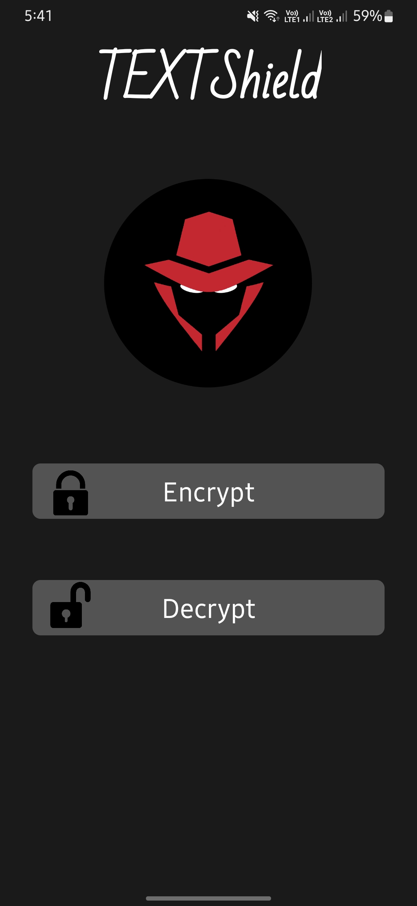
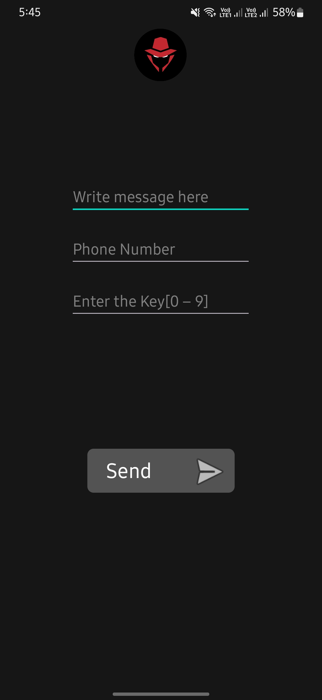
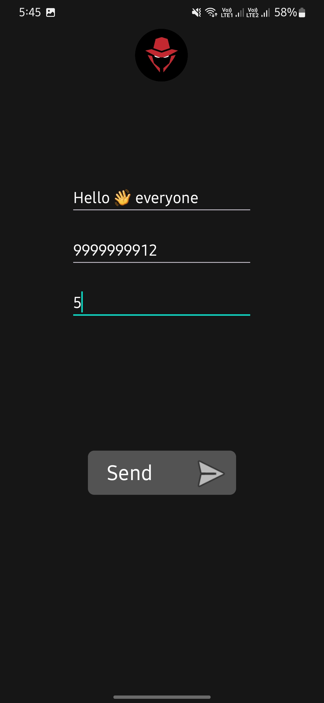
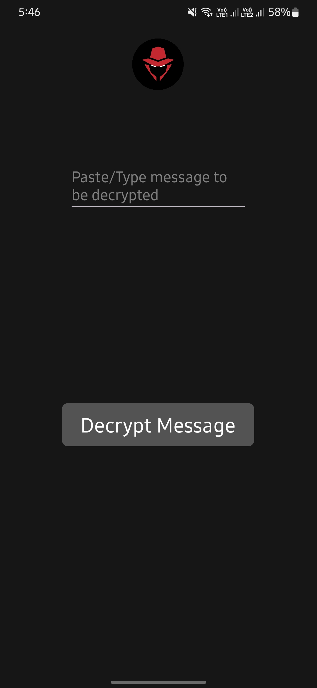
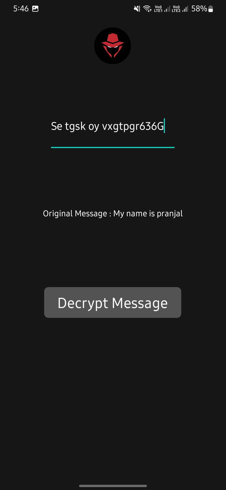

# Android TEXTShield App

## Overview

TextShield is an Android application designed for secure communication. Using the robust Caesar Cipher algorithm, TextShield allows you to encrypt your text messages with a unique key before sending them to your contacts via SMS. The encrypted message ensures that your private information remains confidential and protected.
## Features

- Secure Text Encryption: Encrypt your messages using the Caesar Cipher algorithm to keep your communication private and secure.
- Direct SMS Integration: Send encrypted messages directly to any phone number from within the app.
- Easy Decryption: Recipients can paste the encrypted text into the app and decrypt it using the same key to reveal the original message.
- User-Friendly Interface: Simple and intuitive interface for both encryption and decryption processes.
- Customizable Keys: Set your own encryption key for personalized and secure message encryption.
- Message Preview: Preview your encrypted message while sending it.
- Error Handling: Alerts for missing fields to ensure all necessary information is provided before sending.


## Screenshots

<div align="center">
  
  
</div>

<div align="center">
  
  
</div>

<div align="center">
  
</div>


## Getting Started

### Prerequisites

- Android Studio installed on your system.

### Clone the Repository

```bash
git clone https://github.com/Pranjal-Kri/TextShield.git
```
## Open with Android Studio

1. Open Android Studio.
2. Select "Open an existing Android Studio project."
3. Navigate to the directory where you cloned the repository and select it.

## Build and Run

1. Once the project is open in Android Studio, wait for the Gradle build to complete.
2. Connect your Android device or use an emulator.
3. Click on the "Run" button in Android Studio to install and run the app on your device/emulator.

## Contributing

If you'd like to contribute to the project, feel free to fork the repository and submit a pull request.
